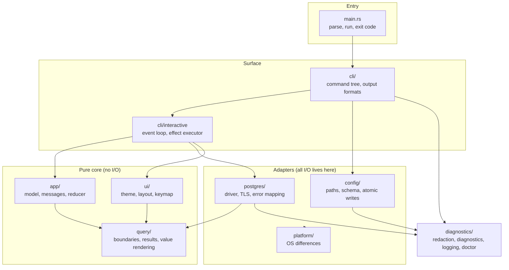

# Components

One process, one binary. The boundaries below are enforced by review and stated
in each module's own documentation, not by separate crates: there is no second
consumer and no compile-time reason to split.

## Responsibilities, and prohibitions

| Module | Owns | Must never |
| --- | --- | --- |
| `app` | The model and the only state transitions | Perform I/O, read a clock, take a lock |
| `ui` | Theme tokens, layout, keymap, terminal lifecycle | Open a connection or write a file |
| `query` | Statement boundaries, result model, value rendering | Know a driver exists |
| `postgres` | Connect, execute, cancel, map errors | Decide application behaviour |
| `config` | Paths, schema, validation, atomic writes, migration | Hold a secret value |
| `diagnostics` | Redaction, layered diagnostics, logging, doctor | Have a second redaction implementation |
| `cli` | Command tree, output contracts, the event loop | Contain domain logic |
| `platform` | OS differences | Grow into a general abstraction layer |

## Why the pure core matters

`app::update` is a pure function, and `ui::layout::render` is a pure function of
the model. That is what makes claims like "a stale result cannot overwrite a
newer query" and "the production marker survives with colour off" provable in
microseconds, without a database, a terminal, or a clock.

Every rule that would otherwise depend on timing is tested by constructing the
state and asserting the transition.
