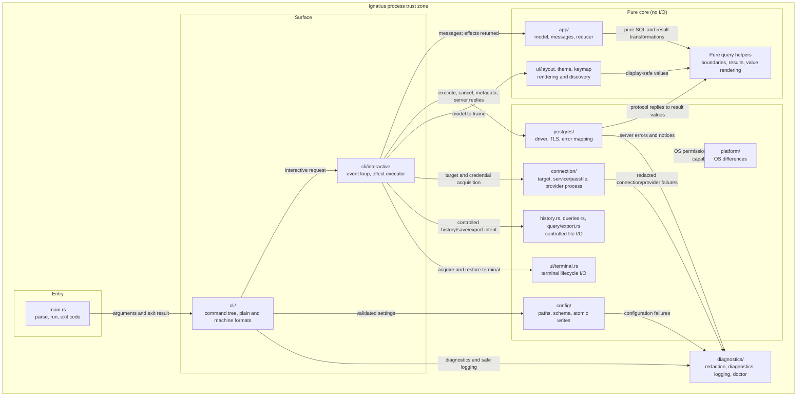

# Components

One process, one binary. The boundaries below are enforced by review and stated
in each module's own documentation, not by separate crates: there is no second
consumer and no compile-time reason to split.

Reconciled on **2026-09-04**. Retain this architecture through the roadmap;
extend a module at its existing boundary before adding another service, crate
or abstraction. [ADR-0012](decisions/0012-enterprise-authentication-without-libpq.md)
keeps `tokio-postgres` and crate-wide unsafe denial.

## Responsibilities, and prohibitions

| Module | Owns | Must never |
| --- | --- | --- |
| `app` | The model and the only state transitions | Perform I/O, read a clock, take a lock |
| `ui::layout`, theme, keymap | Pure rendering, semantic styling, active binding discovery | Perform database, subprocess or filesystem I/O |
| `ui::terminal` | Terminal acquisition, capabilities and restoration | Own query or product state |
| Pure `query` helpers | Lexical boundaries, completion, format, parameter/update plans, result/value/plan models | Open connections, invent PostgreSQL semantics or persist values |
| `postgres` | Connect, execute, cancel, map errors | Decide application behaviour |
| `config` | Paths, schema, validation, atomic writes, migration | Hold a secret value |
| `connection` | Target precedence, credential routes, provider acquisition and safe presentation | Silently downgrade, shell-interpolate values or acquire tokens during rendering |
| `history`, `queries`, `query::export` | Controlled SQL history, named saved files and atomic export | Persist result rows outside explicit export, or bound parameter values in history |
| `clipboard` and its runtime writer | Bounded redacted payload and one confirmed OSC 52 write | Read the clipboard or claim terminal acceptance |
| `diagnostics` | Redaction, layered diagnostics, logging, doctor | Have a second redaction implementation |
| `cli` | Command tree, output contracts, the event loop | Contain domain logic |
| `platform` | OS differences | Grow into a general abstraction layer |

## Why the pure core matters

`app::update` is a pure function, and `ui::layout::render` is a pure function of
the model. That is what makes claims like "a stale result cannot overwrite a
newer query" and "the production marker survives with colour off" provable in
microseconds, without a database, a terminal, or a clock.

Every rule that would otherwise depend on timing is tested by constructing the
state and asserting the transition.

## Interfaces agents extend

| Contract | Existing producer/consumer | Extension rule |
| --- | --- | --- |
| Intent -> `Action` -> `Message` -> `Effect` | Keymap/palette/plain adapter, reducer, executor | Add reachability, no-effect refusal and stale-result tests with every action |
| Target -> `SessionInfo` | Runtime connection resolution and PostgreSQL bootstrap -> safe model facts | Keep resolved credentials outside presentation summaries; observed facts may be unknown |
| Template + `ParameterBindings` -> execution | Prompt/CLI adapter -> PostgreSQL simple-query binding | Values stay separate until the last binding boundary; no prepared-protocol claim |
| Result/source identity -> local view | Execution model -> grid, inspector, copy, update and refresh | Preserve original row/column/job identity across sort/filter/column changes |
| Server/catalogue data -> display | PostgreSQL adapter -> pure models -> rendering/diagnostics | Bound data, escape terminal controls, name stale/unavailable metadata |
| Intent -> local persistence | Runtime -> atomic stores/export | Explicit path/scope, no overwrite without policy, accurate partial/recovery outcome |

These are logical ownership boundaries, not a claim that every data type has
already been moved into a separate port module. For example, current messages
carry PostgreSQL metadata DTOs. Preserve the no-I/O rule in the reducer; extract
a shared value type only when a real dependency or testing problem justifies it.

## Evolution rules

- Keep one PostgreSQL adapter, one lexer foundation and one redaction
  implementation. Query-specific helpers can use a conservative subset of
  lexical structure; ambiguous SQL must be refused or labelled, not guessed.
- Keep I/O off the render path. The event loop coordinates effects; domain
  eligibility and state transitions belong in pure helpers/reducers. The
  `query::export` writer and `ui::terminal` guard are explicit I/O exceptions
  to their otherwise mostly pure directories.
- Do not expand result retention, metadata or subprocess output without a
  byte/row/time bound and recovery plan. W10 measures current gaps first.
- Isolate platform differences behind the existing adapter or test harness.
  A native Windows launcher or ConPTY need does not reopen libpq or permit
  production unsafe code.
- Add dependencies only with a documented purpose, licence/advisory/MSRV
  check and platform cost. Do not change toolchain or distribution targets
  incidentally while implementing an experience slice.
