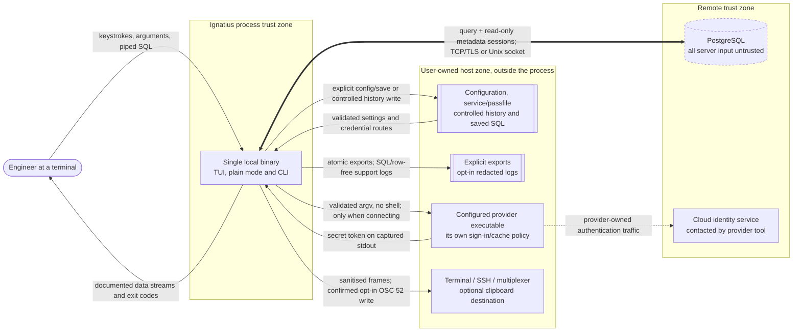

# Context

Reconciled on **2026-09-04** against the current local feature chain. This is
the runtime trust model; [release evidence](../operations/release.md) has a
separate build and distribution trust path. Implementation does not establish
live provider or terminal support; those claims live in the compatibility matrix.

## What crosses each boundary

**User to program.** Keystrokes, command-line arguments, environment variables,
piped SQL. Arguments and environment are visible to other local processes, which
is why a password on the command line is documented as exposed rather than
treated as safe.

**Program to user.** Rendered frames, machine-format data on stdout, diagnostics
on stderr, and an exit code. Terminal-facing server text is escaped; machine
formats preserve data under their own encoding contract and carry no UI
decoration. The generated UPDATE review deliberately displays the bound
statement before confirmation; it must not enter logs or history as bound text.

**Program to disk.** Configuration is validated at startup and written
atomically by explicit commands. Saved SQL is an explicit file operation.
Interactive history is local, scoped, pausable and erasable; parameter values
are excluded and scripted queries are not recorded. Logs exist only when
requested and exclude SQL/row values. Result data is persisted only by explicit
export. Credentials can be read from user-managed routes but are never stored
by Ignatius. ADR-0011 rejects an OS credential store.

**Program to server.** The PostgreSQL wire protocol, over TCP or a Unix socket,
with the TLS policy decided by the client from the resolved `sslmode`. The
interactive metadata connection uses the same target and a server-enforced
read-only session, with a visible shared-connection fallback. Cancellation has
its own protocol connection. No query is silently retried or replayed.

**Program to provider.** A named cloud credential route executes a validated
argument vector and captures a secret token. Encryption eligibility is checked
before acquisition; opening trust details or searching the picker does not run
a provider. The external cloud tool may contact its identity service and own a
cache. Ignatius has no token cache or direct identity HTTP client. Describing
the complete workflow as having no non-database network activity would omit
that provider boundary. There is no telemetry, update check or query upload.

**Program to clipboard path.** One selected value can leave through an explicit,
confirmed, opt-in OSC 52 write. The terminal, SSH path or multiplexer can observe
or retain it. A successful write/flush proves bytes were sent, not acceptance;
the program never reads the clipboard. This is separate from ordinary display
escaping and from disk export.

**Server to program. This is the untrusted direction.** Values, column names,
notices and error text are all attacker-controlled if anyone can write to the
database. Everything arriving here is treated as hostile and escaped before it
reaches the terminal.
