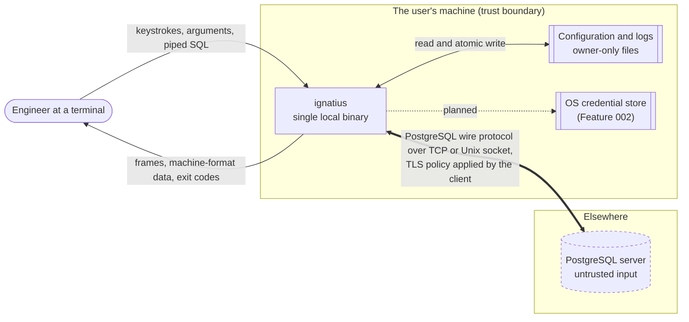

# Context

## What crosses each boundary

**User to program.** Keystrokes, command-line arguments, environment variables,
piped SQL. Arguments and environment are visible to other local processes, which
is why a password on the command line is documented as exposed rather than
treated as safe.

**Program to user.** Rendered frames, machine-format data on stdout, diagnostics
on stderr, and an exit code. Everything derived from the server is escaped first.

**Program to disk.** Configuration read at startup and written atomically only on
an explicit command. Logs only when requested, never containing SQL or row
values. No result data, ever, unless the user exports it.

**Program to server.** The PostgreSQL wire protocol, over TCP or a Unix socket,
with the TLS policy decided by the client from the resolved `sslmode`. This is
the only network traffic the program produces: there is no telemetry, no update
check, and no other host contacted.

**Server to program. This is the untrusted direction.** Values, column names,
notices and error text are all attacker-controlled if anyone can write to the
database. Everything arriving here is treated as hostile and escaped before it
reaches the terminal.
