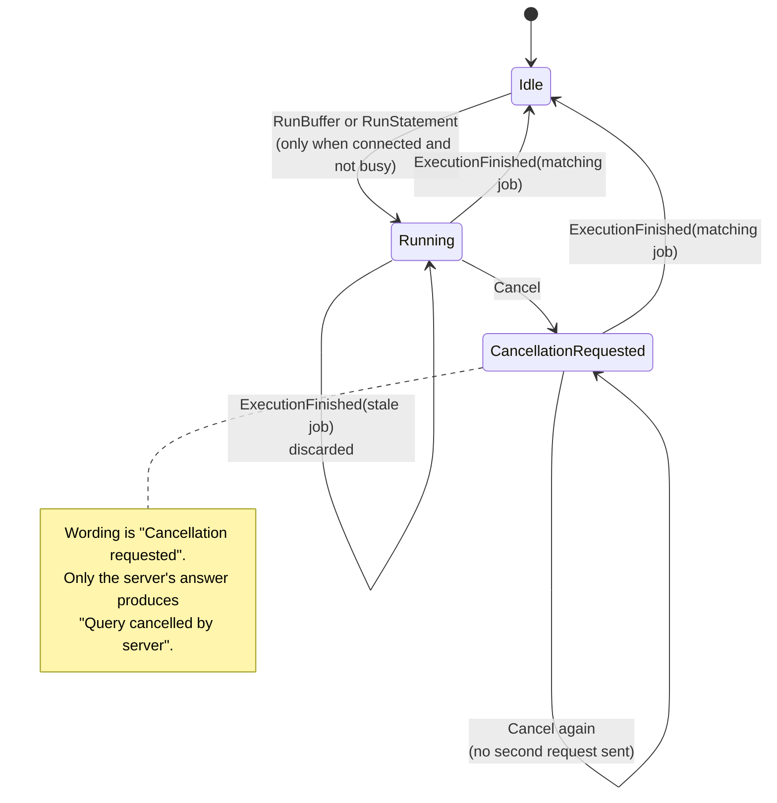

# Runtime state

Reconciled on **2026-09-04**. This describes the execution model and identity
invariants inspected in the local Features 012-024 chain. Its profile-switch,
parameter, plan, grid, update and refresh extensions await W01 integration into
main; the baseline query/cancellation and terminal lifecycles already exist.

## The loop

```text
key press, resize, signal, or async completion
        -> Message
        -> update(&mut Model, Message) -> Vec<Effect>      (pure)
        -> executor performs each Effect                    (async, off the render path)
        -> new Messages
        -> render(&Model) -> frame                          (pure)
```

Input is read on its own thread and database work runs on the async runtime, so
neither can block drawing. The reducer is the only place state changes.

## Query lifecycle



Every job carries an identity. A result whose identity is not the one in flight is
discarded, so a slow query finishing after a newer one cannot overwrite the newer
result. This is asserted by test, not by timing.

## Connection lifecycle

```mermaid
stateDiagram-v2
    [*] --> Disconnected
    %% Trust boundary: connection facts are read from the selected PostgreSQL server.
    %% Open evidence: native cloud launcher and provider-account behaviour (W06).
    Disconnected --> Connecting: startup
    Connecting --> Connected: session facts read back from the server
    Connecting --> Failed: diagnostic shown, exit code mapped
    Connected --> Lost: connection dropped
    Connected --> Connecting: explicit quiet profile choice (local Feature 020; W01 pending)
    Lost --> [*]: no automatic reconnection in this release
    note right of Lost
        A statement in flight when this
        happens reports "Connection lost -
        query outcome unknown". Nothing
        is retried or replayed.
    end note
```



`Connected` is only entered after the server has answered questions about itself:
version, backend pid, search path, read-only posture and transport state. Those
facts come from the server, not from what was requested.

An explicit quiet-session profile choice re-enters connecting. The runtime
increments a connection generation and discards late work from the old target.
It clears old server facts, results, catalogue and pending prompts while keeping
the editor and documented local reading preferences. It does not reconnect on
loss automatically. `Reconnect` in the effect enum is the explicit password-
prompt retry during authentication, not authorization to replay a query.

## Identity and confirmation boundaries

| Identity | Protects | Agent rule |
| --- | --- | --- |
| Connection generation in the runtime | Connection and metadata completions after a profile switch | Check current generation before publishing old facts; W02 reviews combined interleavings |
| Query/plan job identity | Foreground completions and cancel intent | Accept only the matching operation; keep ordinary results and plan state separate |
| Metadata request and object path | Tree definitions, dependencies and catalogue refresh | Reject superseded responses and expose loading/stale/unavailable states |
| Retained source job, row and column | Grid selection, copy and generated UPDATE | Use original positions, not sorted/filtered view indexes; revalidate at confirmation |
| Template and parameter bindings | Prompted query, reviewed write and explicit refresh | Keep values secret-bound and ephemeral; history retains the template, refresh prompts again |

The current implementation distributes those checks between the reducer and
runtime. This table states the contract to verify, not evidence that every
possible interleaving has already passed a runtime test.

Local view actions produce no execution effect. Plain EXPLAIN requests an
estimate; ANALYZE executes the statement after explicit confirmation and does
not imply rollback. A cell UPDATE has separate metadata, replacement and
exact-bound-review stages; only final confirmation sends one write. The prior
result remains a snapshot. A refresh explicitly reruns the eligible retained
source once, ignores later editor edits and re-prompts for parameters.

An outcome may be completed, failed, cancelled by the server or unknown after
connection loss. `Cancellation requested` and a successfully delivered cancel
packet cannot establish which of those occurred. Never infer a commit,
rollback, affected row or fresh result from losing the transport.

### The object tree's connection

Once the session is up, a second connection is opened for the object tree. It is
made from the same resolved target - the same host, the same credential route,
the same TLS outcome - moved rather than derived again, so there is no way for
the two to disagree about how they reached the server.

Two things differ, on purpose, and both are visible in `pg_stat_activity`:

| Difference | Why |
| --- | --- |
| `application_name` gains ` (objects)` | So someone reading the server's activity can tell the tree from the query |
| The session is read-only | Reading the catalogue is all it ever does, and the server is what enforces that rather than a guess here |

Failing to open it is not a failure of the session. The tree falls back to the
connection that is already there, and the header says `[objects: shared
connection]`, because a connection limit or a pooler is a real place to be and
the reason the tree can be slow behind a long query is worth knowing.

`ignatius connect --check` states that the interactive client opens this second
connection, since a second connection is a real cost on a constrained server.

## Terminal lifecycle

Acquisition happens once, guarded by RAII, after a panic hook is installed.
Restoration runs on every exit path and is idempotent, so an explicit restore
followed by a drop is safe. Modes are undone in reverse order, with the alternate
screen left last.

## What is deliberately absent

- No global mutable state. The model is owned by the loop.
- No automatic reconnection. It would risk misrepresenting a transaction.
- No implicit re-execution, anywhere, for any reason.
- No timing-dependent state transitions, which is why the reducer takes no clock.
