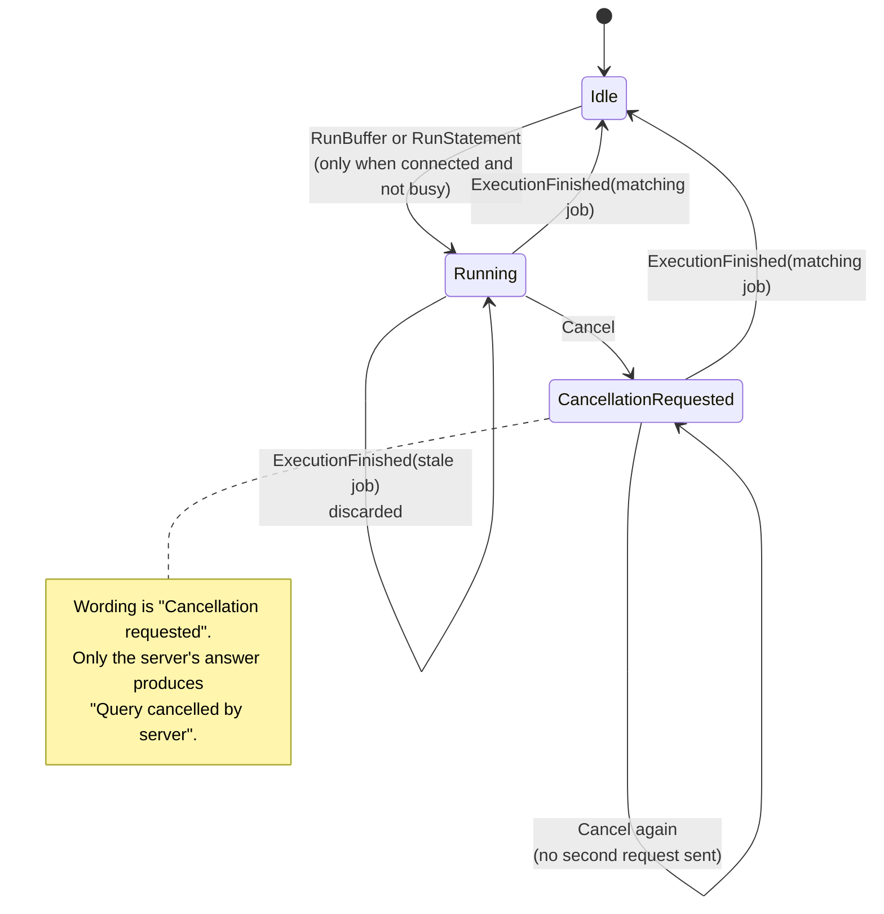
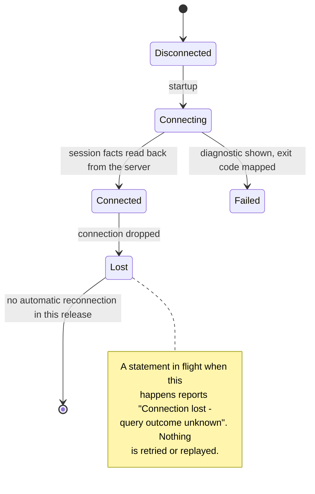

# Runtime state

## The loop

```text
key press, resize, signal, or async completion
        -> Message
        -> update(&mut Model, Message) -> Vec<Effect>      (pure)
        -> executor performs each Effect                    (async, off the render path)
        -> new Messages
        -> render(&Model) -> frame                          (pure)
```

Input is read on its own thread and database work runs on the async runtime, so
neither can block drawing. The reducer is the only place state changes.

## Query lifecycle



Every job carries an identity. A result whose identity is not the one in flight is
discarded, so a slow query finishing after a newer one cannot overwrite the newer
result. This is asserted by test, not by timing.

## Connection lifecycle



`Connected` is only entered after the server has answered questions about itself:
version, backend pid, search path, read-only posture and transport state. Those
facts come from the server, not from what was requested.

### The object tree's connection

Once the session is up, a second connection is opened for the object tree. It is
made from the same resolved target - the same host, the same credential route,
the same TLS outcome - moved rather than derived again, so there is no way for
the two to disagree about how they reached the server.

Two things differ, on purpose, and both are visible in `pg_stat_activity`:

| Difference | Why |
| --- | --- |
| `application_name` gains ` (objects)` | So someone reading the server's activity can tell the tree from the query |
| The session is read-only | Reading the catalogue is all it ever does, and the server is what enforces that rather than a guess here |

Failing to open it is not a failure of the session. The tree falls back to the
connection that is already there, and the header says `[objects: shared
connection]`, because a connection limit or a pooler is a real place to be and
the reason the tree can be slow behind a long query is worth knowing.

`ignatius connect --check` states that the interactive client opens this second
connection, since a second connection is a real cost on a constrained server.

## Terminal lifecycle

Acquisition happens once, guarded by RAII, after a panic hook is installed.
Restoration runs on every exit path and is idempotent, so an explicit restore
followed by a drop is safe. Modes are undone in reverse order, with the alternate
screen left last.

## What is deliberately absent

- No global mutable state. The model is owned by the loop.
- No automatic reconnection. It would risk misrepresenting a transaction.
- No implicit re-execution, anywhere, for any reason.
- No timing-dependent state transitions, which is why the reducer takes no clock.
