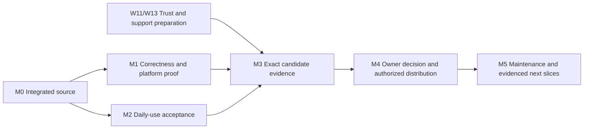

# Roadmap

**Replanned 2026-09-04.** Deliver a PostgreSQL workbench that is easy to discover,
truthful under pressure and dependable in both a terminal and a script.
The planned experience through Feature 024 was implemented in the originating
local feature worktree. This documentation integration leaves main's application
at `52872ac`; it does not merge that feature chain. W01 retrieves and integrates
its source, specifications and evidence before the later acceptance work.

The latest completed local slice at the planning snapshot was
**024 Explicit retained-result refresh**. Its recorded plain/TLS verifier pass,
semantic Unix-socket skip and outstanding terminal checks belong to that local
worktree, as recorded in the [dated baseline](planning-baseline.md).

| Read this for | Authority |
| --- | --- |
| Product intent and users | [Vision](vision.md), [personas](personas-and-jobs.md), [experience rationale](experience-roadmap.md) |
| Evidence behind this plan and every existing feature | [Dated baseline and feature inventory](planning-baseline.md) |
| What success looks like | [Product outcomes and acceptance journeys](acceptance.md) |
| Assignable work, dependencies and definitions of done | [Agent delivery plan, W01-W16](agent-delivery-plan.md) |
| Architecture and extension boundaries | [Components](../architecture/containers-and-components.md), [runtime](../architecture/runtime-state.md), [trust context](../architecture/context.md) |
| How agents take and return work | [Agent playbook](../operations/agent-playbook.md) |
| What is actually done now | [Status](../status.md), current worktree, each feature's `tasks.md` |

## Product scope

The complete product joins six outcomes: trustworthy connection and execution
state; low-recall query authoring; useful result exploration; recoverable
failure; private, consistent automation; and verifiable installation and support.
[O1-O6](acceptance.md) maps each to scenarios and delivery owners.

The intended release scope includes the foundation, existing connection and
query workflows, and experience slices 012-024 once their acceptance is proved.
Feature 008 supplies the release contract. Local implementation, integration,
platform evidence, release readiness and publication are separate states.
Unchecked evidence remains work even when implementation tasks are ticked.

The product stays local-first and PostgreSQL-specific, with a pure state model,
one scriptable binary, deliberate side effects and explicit unsupported
capabilities. The OS credential store was rejected by ADR-0011; libpq was closed
without implementation by ADR-0012. Neither is an open delivery dependency.
The constitutional non-goals in the vision remain outside this roadmap.

## Milestones and exit gates

Milestones express dependency order, not dates or version numbers. `Cargo.toml`
remains the product-version authority. Completion requires the evidence named
below; broadening the feature list does not move a milestone forward.

| Milestone | User-visible result | Work packages | Exit gate |
| --- | --- | --- | --- |
| M0 Reproducible integrated product | The local feature chain is coherent and reviewable | W01 | Intended changes preserved, integrated focused/full verification recorded, exact source boundary known |
| M1 Trustworthy across supported environments | Connection, query, result and recovery behaviour stay truthful on declared platforms | W02-W08, W10 | Interleaving/privacy/protocol checks, PostgreSQL matrix, native/provider evidence, restoration and resource/recovery requirements satisfied for claimed scope |
| M2 Proven daily experience | A newcomer finds the workflow and a daily user can rely on it | W08-W10 | First-use targets assessed, daily-use blockers fixed and affected scenarios repeated; no unresolved material safety misunderstanding |
| M3 Verifiable release candidate | An operator can identify, verify, install and roll back the candidate | W11-W13 plus M1/M2 | Canonical technical evidence, inventory, signatures/provenance, runtime privacy, recovery and support prerequisites accepted; any final owner gate stays blocking in 008 T033 |
| M4 Owner-approved distribution | The reviewed candidate reaches only the authorized destination | W14 | Explicit owner decision, readiness check passes after required authorization, and authorized bytes/metadata independently verified; T033/T035/status/catalogue accurately closed |
| M5 Supported daily tool | Patches keep pace with real usage and supported environments | W15; W16 when justified | Each maintenance cycle closes reported failures and repeats affected release gates; new scope starts from observed jobs |

## Start here

1. **W01:** recheck the current worktree and inherited Feature 024 completion
   evidence, then prepare a reproducible integration baseline. Historical main
   CI is not evidence for newer uncommitted features.
2. **W02-W07 and W10:** resolve correctness, privacy, native-platform and
   resource/recovery gaps. Assign shared runtime files to one integrator;
   use isolated auth and terminal scopes where parallel work is authorized.
3. **W08-W09:** run complete terminal, accessibility, first-use and daily-use
   journeys. Feedback may begin earlier; final acceptance follows the code it
   claims to validate.
4. **W11 and W13 preparation can proceed alongside those steps.** Prepare
   concrete trust, support, naming and governance decisions before owner review.
   Proceed to W12/W14 only when their dependencies and authority exist.

Use full feature directory slugs in assignments. The historical `007` collision
and old broad-theme numbers are documented in the inventory; neither justifies
renaming specifications or reusing a feature ID.

## Decisions and external dependencies

| Decision or access | Required before | Preparation owner | Authority |
| --- | --- | --- | --- |
| Inventory/SBOM, signing identity/custody, provenance and retention | Live supply-chain implementation and readiness claim | W11 | ADR-0008 and Feature 008 |
| Native Windows/Linux/WSL and screen-reader access | Corresponding platform acceptance | W06-W08 | Constitution VII/IX; foundation/plain-mode open tasks |
| Controlled Entra, AWS and GCP account/database access | Corresponding vendor-auth claim | W06 | Features 011/017; compatibility provider rows |
| Private vulnerability route and hosting enforcement | Public support/distribution claims | W13 | SECURITY, release guide and actual repository settings |
| Outstanding trademark/domain and distribution audience decision | Public distribution | W13/owner | Landscape naming record; no purchase or legal clearance implied |
| Exact tag, signature, workflow dispatch, push or publication operation | That external action | W14/owner | Existing explicit session authority or concrete owner approval |

Unavailable evidence leaves its row open while independent work continues.
Do not replace a mandatory gate with an assumption or ask the owner to choose
among unspecified alternatives.

## Risks that determine priority

| Risk | Consequence | Prevention and owner |
| --- | --- | --- |
| Shared-file feature chain is integrated incorrectly | Wrong target, stale result or lost behaviour | W01 scopes ownership; W02 tests combined transitions |
| Parameter/update/refresh interactions leak or repeat work | Disclosure, wrong write or false outcome | W03 semantics and W04 privacy; no replay and explicit review |
| Provider launch differs by OS | Supported cloud route fails before connecting | W06 reproduces actual launchers and retains security boundaries |
| Automated UI tests substitute for human use | Undiscoverable actions or broken terminal state | W07-W09 native harnesses, hand use and observed journeys |
| A row cap masks unbounded individual inputs | Memory exhaustion or an unresponsive client | W10 measures values, notices, catalogue and subprocess output |
| Old evidence is reused for changed code | Unsupported release claims | W05/W12 bind claims to source/build/target and retained bytes |
| Trust/support mechanisms remain unspecified | Package cannot be released or supported | W11/W13 prepare decisions before candidate freeze |
| Scope expansion overtakes verification | Product stays implemented but unproven | Finish M0-M3; W16 requires observed need and support cost |

## After the initial delivery

W15 makes maintenance part of the product: security/dependency review,
PostgreSQL support-window review, provider compatibility, regressions and
repeatable patch releases. W16 contains conditional opportunities for deeper
PostgreSQL workflows, concurrency protection, connection options and platform
convenience. Each needs evidence of a real job, a complete specification and
the same acceptance gates. No new feature is required merely to keep the
roadmap busy.
