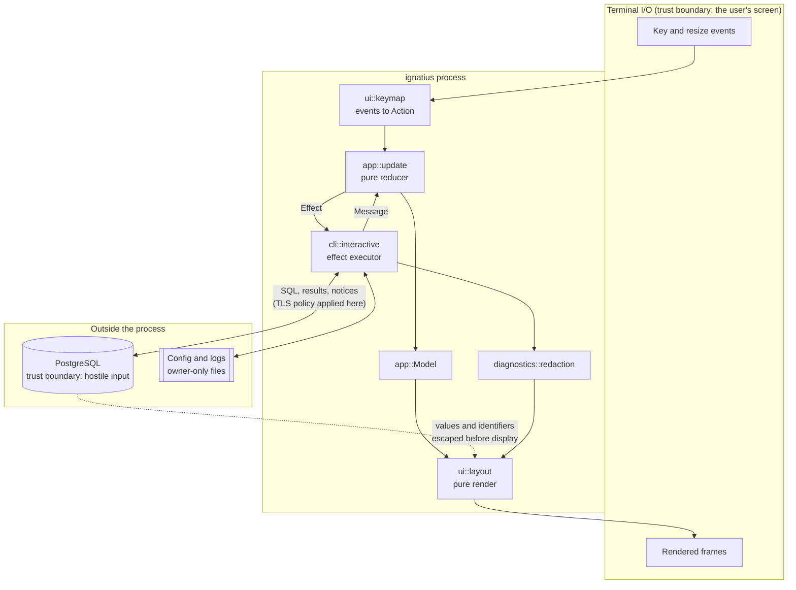

# Implementation Plan: Foundation and proven vertical slice

**Branch**: `001-foundation-vertical-slice` | **Date**: 2026-08-15 | **Spec**: [spec.md](./spec.md)

## Summary

Build the smallest thing that is genuinely trustworthy: one binary that opens a
full-screen PostgreSQL client, runs a query, explains a failure, cancels a long
statement, and gives the terminal back. The same binary is a scriptable CLI with
documented exit codes.

The architecture established here is the point. Every later feature plugs into
it, so the reducer, the ports, the diagnostic shape and the terminal lifecycle
have to be right now rather than later.

## Technical Context

**Language/Version**: Rust, stable, edition 2024. Local toolchain rustc 1.97.1.

**Primary Dependencies**: ratatui 0.30.2 with crossterm 0.29.0, tokio 1.53,
tokio-postgres 0.7.18, rustls 0.23 with rustls-platform-verifier 0.7, clap 4.6,
serde with toml 1.1, secrecy 0.10, thiserror 2, tracing 0.1, directories 6,
unicode-width 0.2.

**Storage**: TOML configuration in XDG-style locations. No database of our own.

**Testing**: `cargo test` for unit, reducer and layout tests; `tests/` for the
CLI contract and PostgreSQL integration; `docker/compose.yaml` for a disposable
server with synthetic data.

**Target Platform**: macOS (Warp), Windows 11 (Windows Terminal), Linux.

**Project Type**: Single Rust package, library plus thin binary.

**Performance Goals**: Interface draws before the connection completes; input and
rendering never wait on the database; result memory bounded by an explicit cap.

**Constraints**: No network call other than the database connection. No secret in
any output. No implicit migration, retry, or TLS downgrade.

## Constitution Check

| Principle | How this plan satisfies it |
| --- | --- |
| I Truthful delight | TLS state read from `pg_stat_ssl`; `Cancellation requested` is a distinct state; connection loss reports unknown outcome |
| II PostgreSQL first | Simple query protocol preserves server text rendering; SQLSTATE and every server error field surfaced |
| III Local-first | No network call but the connection; nothing persisted; logging off by default |
| IV Safe by default | Unsupported security parameters refused; no replay or retry; remote defaults to verify-full |
| V Keyboard-first | Every action bound and listed in help; mouse off by default |
| VI Styling loss | Bracketed word markers; contrast-tested palettes; ASCII mode; text labels for every state |
| VII Cross-platform | One terminal abstraction; platform differences isolated in `src/platform`; CI matrix |
| VIII One source of truth | Branding, exit codes, config schema and release identity each have exactly one home |
| IX Evidence | Container-backed protocol tests; pty-level terminal evidence; traceability table below |
| X Recoverability | RAII guard plus panic hook; atomic writes; backup before migration |

No principle required an exception. The `Complexity Tracking` section is empty.

## Project Structure

```text
src/
  main.rs               Thin process entry point
  lib.rs                Module map
  branding.rs           The only place the product name lives
  exit_code.rs          The exit-code contract
  app/                  Model, messages, pure reducer, effects
  cli/                  Command tree, output formats, interactive runtime
  config/               Paths, schema, validation, atomic writes, migration
  connection/           Target resolution, precedence, TLS policy, classification
  postgres/             Driver adapter, session, cancellation, error mapping
  query/                Statement boundaries, result model, value rendering
  ui/                   Terminal lifecycle, theme tokens, layout, keymap
  diagnostics/          Redaction, layered diagnostics, logging, doctor
  platform/             macOS, Windows and Linux differences
tests/
  cli_contract.rs       Exit codes and stream contracts, as a subprocess
  postgres_integration.rs   Protocol claims against a real server
docker/                 Disposable server and synthetic fixtures
```

**Structure Decision**: One package. There is no second consumer of the library
and no compile-time reason to split, so a workspace would add ceremony without
a boundary. Module boundaries are enforced by review and by the module docs: `ui`
never opens a connection, `app` never performs I/O, and only `postgres` knows the
driver exists.

## Architecture



Rules the diagram encodes: messages only ever flow one way into the reducer;
effects are requests, not work; everything crossing the boundary from PostgreSQL
is treated as hostile and escaped before it reaches the screen; and everything
crossing into a log, a diagnostic or the screen passes through redaction.

## Key design decisions

Recorded as ADRs in `docs/architecture/decisions/`: Rust (0001), Ratatui with
Crossterm (0002), tokio-postgres with the simple query protocol (0003), rustls
with the platform trust store and `verify-ca` refused (0004), a hand-written
statement lexer (0005), TOML in XDG-style locations with SQLite deferred (0006),
secrets in dedicated types with the keyring deferred (0007), and a hand-rolled
release workflow with cargo-dist deferred (0008).

## Requirement-to-test traceability

| Requirement | Evidence |
| --- | --- |
| FR-001 | `cli_contract::help_and_version_succeed_and_go_to_stdout`, `the_interactive_client_refuses_to_start_without_a_terminal` |
| FR-002 | `connection::target::tests::arguments_beat_connection_string_which_beats_environment` |
| FR-003 | `connection::target::tests::uri_parsing_handles_userinfo_ipv6_sockets_and_escapes`, `keyword_value_parsing_handles_quotes_and_escapes` |
| FR-004 | `query::statements::tests::*` (11 tests), `app::update::tests::running_the_statement_at_the_cursor_sends_only_that_statement` |
| FR-005 | `postgres_integration::multiple_statements_produce_multiple_results_in_order`, `server_notices_reach_the_client` |
| FR-006 | `postgres_integration::a_long_statement_can_be_cancelled_and_the_server_confirms_it` |
| FR-007 | `cli::tests::commands_parse_the_way_the_documentation_says` |
| FR-008 | `cli::output::tests::*` (12 tests), `ndjson_writes_one_object_per_line_and_refuses_multiple_result_sets` |
| FR-009 | `config::store::tests::migration_is_idempotent_and_backs_up_before_changing_anything` |
| UX-001 | `ui::layout::tests::the_full_layout_shows_connection_environment_tls_and_hints` |
| UX-002 | `ui::layout::tests::an_error_shows_headline_cause_and_next_action_before_technical_detail` |
| UX-003 | `app::update::tests::cancelling_requests_but_does_not_claim_cancellation`, `query::result::tests::status_wording_never_claims_more_than_is_known` |
| UX-004 | `ui::layout::tests::a_production_connection_is_unmistakable_without_colour`, `every_theme_and_colour_mode_renders_the_same_meaning` |
| UX-005 | `cli::interactive::tests::the_starter_buffer_is_useful_and_names_the_run_key`, `ui::layout::tests::an_empty_state_says_what_to_do_next` |
| UX-006 | `query::value::tests::null_is_distinguishable_from_empty_string_and_from_the_text_null`, `postgres_integration::null_is_distinguishable_from_an_empty_string_over_the_wire` |
| SEC-001 | `diagnostics::redaction::tests::*` (10 tests), `cli_contract::secrets_never_appear_in_output_even_when_the_connection_fails`, `postgres_integration::a_wrong_password_is_reported_as_authentication_not_as_a_generic_failure` |
| SEC-002 | `postgres_integration::requiring_tls_against_a_server_without_it_fails_rather_than_downgrading`, `postgres::error::tests::tls_advice_never_suggests_connecting_without_tls_when_it_was_required` |
| SEC-003 | `postgres_integration::the_session_reports_what_the_server_says_about_itself`, `postgres::tls::tests::an_unconfirmable_tls_state_is_reported_as_unknown_not_as_encrypted` |
| SEC-004 | `connection::target::tests::security_parameters_fail_and_other_unknowns_only_warn`, `cli_contract::a_security_relevant_parameter_is_refused_rather_than_ignored` |
| SEC-005 | `query::value::tests::escape_sequences_from_the_database_cannot_reach_the_terminal`, `ui::layout::tests::hostile_values_cannot_emit_escape_sequences_into_the_interface`, `postgres_integration::hostile_values_from_the_database_cannot_drive_the_terminal` |
| SEC-006 | `connection::target::tests::environment_classification_is_explicit_never_guessed` |
| REL-001 | `ui::terminal::tests::every_mode_that_is_enabled_is_disabled_again`, `restore_order_is_the_reverse_of_acquisition`; pty evidence in `docs/operations/verification.md` |
| REL-002 | `query::result::tests::a_result_set_stops_at_its_cap_but_keeps_counting`, `postgres_integration::results_are_bounded_by_the_row_cap_and_report_the_true_count` |
| REL-003 | `app::update::tests::a_stale_result_cannot_overwrite_a_newer_query` |
| REL-004 | `config::store::tests::save_is_atomic_and_leaves_no_temporary_file` |
| PERF-001 | Connection runs as an effect; first frame drawn before it completes. Pty evidence in `docs/operations/verification.md` |
| PERF-002 | Input thread and async executor are separate from rendering; see `cli::interactive` |
| OPS-001 | `diagnostics::doctor::tests::every_non_ok_check_states_a_next_action`, `cli_contract::doctor_json_is_valid_json_and_carries_the_same_checks` |
| OPS-002 | `cli_contract::version_verbose_separates_product_source_and_build_identity` |
| OPS-003 | `diagnostics::logging::tests::statement_descriptor_never_contains_the_sql`, `logging_is_disabled_when_the_variable_is_absent_or_empty` |
| COMPAT-001 | `exit_code::tests::numeric_values_are_the_documented_contract`, plus real invocations in `cli_contract` for 0, 2, 3, 4, 7 |
| COMPAT-002 | `ui::terminal::tests::no_color_and_dumb_terminals_win_over_configuration`, `cli_contract::piped_output_carries_no_colour_and_no_control_sequences` |
| COMPAT-003 | `connection::target::tests::service_and_password_files_are_reported_as_unread_rather_than_ignored` |

Exit codes 5, 6, 8 and 9 are produced by library-level tests but not yet by a
subprocess invocation; 9 has no producer at all until export lands in Feature
004. This gap is recorded in `docs/status.md` rather than papered over.

## Complexity Tracking

None. No principle needed an exception for this feature.
