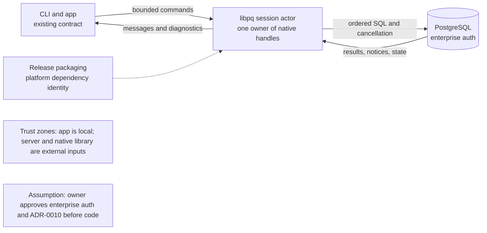

# Implementation Plan: Enterprise PostgreSQL authentication

**Branch**: `001a-libpq-migration` | **Date**: 2026-08-16 | **Spec**:
[spec.md](./spec.md)

## Status and gate

This is a planning package, not an implementation authorization. Work after
the design artifacts is blocked until the owner confirms that the remaining
enterprise authentication requirement justifies libpq and accepts the
concurrency and distribution costs recorded in ADR-0010.

## Summary

Preserve the existing adapter boundary while introducing only the native
capabilities that the owner approves. The migration must prove enterprise
authentication, session ordering, cancellation, resource cleanup, security and
release packaging on the named platforms before the roadmap can call it done.

## Technical Context

**Language/Version**: Rust, edition 2024, stable toolchain as pinned by the
repository. The current crate denies unsafe code; any adapter exception is
scoped and justified by ADR-0009 and ADR-0010.

**Driver surface**: libpq through a maintained safe wrapper where one meets the
required authentication and platform surface. A bespoke binding is a fallback,
not an assumed dependency. The exact crate or binding is a Phase 0 decision.

**Concurrency**: proposed one serialized session actor per native connection,
as described in ADR-0010. Non-blocking polling remains an alternative if a
spike proves it materially safer and simpler.

**Storage**: no new application storage. Existing password-file, service-file,
configuration and logging contracts remain authoritative.

**Testing**: existing unit, reducer, layout, CLI contract and PostgreSQL
integration tests; new server-backed enterprise tests only in controlled
environments. Every platform claim must name its environment and evidence.

**Target Platform**: macOS, Windows and Linux. Windows packaging and native
library loading are first-class gates, not release follow-up work.

**Performance goals**: input and rendering remain responsive; one session
preserves server order; command queues have bounded back pressure; shutdown
does not leave native handles or worker threads behind.

**Constraints**: no silent authentication or TLS downgrade, no automatic query
replay, no secrets in source or output, no native-driver knowledge outside
`src/postgres`, and no implementation until the owner gate is answered.

## Constitution Check

| Principle | How this plan satisfies it |
| --- | --- |
| I Truthful delight | Auth posture, native dependency state, cancellation and unknown outcomes are stated rather than inferred |
| II PostgreSQL first | Server authentication, SQLSTATE, transaction order and server-rendered values remain authoritative |
| III Local-first | No new service or telemetry is introduced; the native dependency is used only for the chosen database connection |
| IV Safe by default | No weaker fallback, automatic replay or transport downgrade is permitted |
| V Keyboard-first | The adapter does not alter the existing keyboard surface or add a modal workflow |
| VI Styling loss | Existing textual diagnostics and stream contracts survive with colour, Unicode and full-screen features unavailable |
| VII Cross-platform | macOS, Windows and Linux dependency and authentication evidence are explicit gates |
| VIII One source of truth | Adapter boundary, diagnostics, exit codes, dependency identity and packaging each retain one authority |
| IX Evidence | Server-backed authentication, compatibility, failure and clean-install evidence is required before completion |
| X Recoverability | Native handles, workers, cancellation and shutdown have explicit lifecycle tests; no uncertain query is replayed |

No new constitutional exception is requested. The unsafe boundary is already
recorded in ADR-0009 and narrowed further by ADR-0010.

## Project Structure

The following are proposed ownership locations. They must not be created until
the decision gate is approved.

```text
src/postgres/
  adapter.rs             Native-driver boundary and lifecycle ownership
  session.rs             Existing session contract, adapted behind the boundary
  error.rs               Existing diagnostic mapping plus native failures
  tls.rs                 Existing TLS policy and negotiated-state reporting
tests/
  postgres_libpq.rs      Controlled enterprise-authentication and lifecycle tests
  cli_contract.rs        Existing stream and exit-code contract, extended only after handoff
docker/ or CI services/  Synthetic or controlled server fixtures, never credentials from users
docs/architecture/decisions/
  0010-libpq-concurrency-model.md
docs/operations/
  local-development.md, verification.md, release.md
```

The reducer, query model, UI, plain mode, configuration schema and diagnostics
shape remain consumers of the existing adapter contract. No new cross-module
shortcut is allowed.

## Architecture



The actor boundary is a proposed design, not evidence that code exists. The
server remains the authority for authentication outcome, transaction state,
cancellation and whether a statement's outcome is known.

## Phases

### Phase 0: Decision and research gates

1. Confirm the required enterprise authentication route and target platforms.
2. Compare wrapper and binding choices for license, maintenance, supported
   authentication, platform coverage and unsafe surface.
3. Validate the proposed session actor against cancellation, shutdown,
   transaction ordering and back-pressure scenarios.
4. Decide whether the native library is bundled, discovered or installed on
   each release platform.
5. Record the approved choices in ADR-0010 and update ADR-0009 if the owner
   reverses or narrows its decision.

### Phase 1: Adapter seam and lifecycle spike

Create the smallest adapter seam behind `src/postgres` and prove connect,
ordered execution, notices, error mapping, cancellation and close with a
synthetic server. Keep the existing driver available until parity evidence
exists; do not hide a partial migration behind a default flag.

### Phase 2: Enterprise authentication

Implement only the approved routes. Add controlled server-backed tests for each
platform and record the exact prerequisites, authenticated role and failure
wording. Unsupported combinations must fail before a misleading fallback.

### Phase 3: Compatibility and security parity

Run the existing matrix for target precedence, password and service files, TLS
policy, client certificates, result formats, notices, failed transactions,
cancellation, connection loss, redaction and exit codes. Compare against the
pre-migration baseline and update the threat model for the native dependency.

### Phase 4: Distribution and release evidence

Build clean artifacts on macOS, Windows and Linux. Verify architecture,
dependency discovery or bundled files, version identity, checksums and the
repair path for a missing dependency. Do not claim a self-contained binary on
platforms where the evidence says otherwise.

### Phase 5: Handoff and completion

Update the roadmap, status, compatibility and release documentation only after
the gates pass. Mark tasks complete by evidence, not by code presence, and
retain the current adapter if any required gate remains open.

## Requirement-to-evidence traceability

| Requirement group | Required evidence |
| --- | --- |
| FR-1001, FR-1007 | Controlled server-backed test for every approved route and explicit unsupported-route tests |
| FR-1002, COMPAT-1001, COMPAT-1003 | Existing full verification suite plus before/after exit, stream, TLS, credential and result comparisons |
| FR-1003, FR-1004, FR-1005, FR-1009 | Session actor ordering, cancellation race, connection loss and shutdown tests against a real server |
| FR-1006, UX-1001 to UX-1004 | CLI and plain-mode transcript assertions, redacted failure fixtures and platform dependency diagnostics |
| FR-1008, SEC-1002 | Static module-boundary review and a build/test check that pure layers do not import the native adapter |
| FR-1010, COMPAT-1002 | Clean-machine artifact tests on all three platforms with dependency identity recorded |
| SEC-1001, SEC-1003, SEC-1004 | Adversarial logs/diagnostics, TLS downgrade refusal and dependency-loading review |
| SC-1001 to SC-1006 | Owner-approved acceptance matrix and release evidence referenced from `docs/operations/verification.md` |

## Complexity Tracking

No complexity exception is approved. If a native wrapper or platform package
requires one, stop and amend ADR-0010 before adding code.
