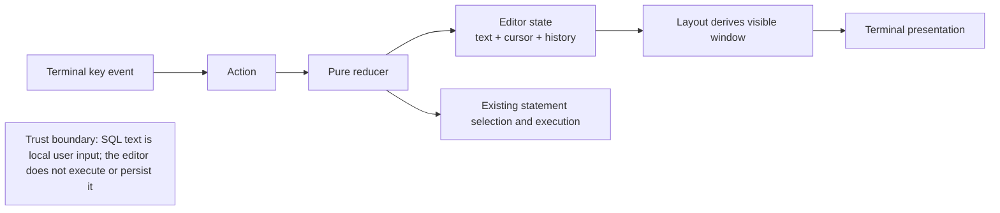

# Implementation Plan: Writing the SQL

**Branch**: `005-sql-editing` | **Date**: 2026-08-16 | **Spec**:
[spec.md](./spec.md)

## Status and gate

This plan formalises the editor slice already committed in `555203f`. The
implementation is not acceptance-complete: the real Enter path bypasses
indent-preserving newline insertion, and cursor movement does not yet end an
undo coalescing run. The source follow-up remains Claude's ownership; this
package owns the documentation and evidence boundary.

## Summary

Keep SQL editing in a small pure buffer model and route all user input through
the existing message and reducer boundary. The editor stores text and a UTF-8
boundary-safe cursor, derives its visible window from the cursor, and keeps
bounded snapshots for undo and redo. The UI renders the same model in full,
compact and ASCII modes without adding a clipboard, filesystem or syntax
highlighting dependency.

## Technical Context

**Language and toolchain**: Rust edition 2024 with the repository's pinned
stable toolchain.

**Terminal surface**: `crossterm` key events and `ratatui` rendering through the
existing `Action`, `Message`, reducer and layout modules.

**State model**: `Editor` owns the SQL text, a byte-offset cursor on a character
boundary, modified state, vertical goal column and bounded undo and redo
snapshots. `Model` owns one editor and focus decides whether editing actions are
accepted.

**Dependencies**: no new dependency. Existing statement boundary helpers remain
the authority for SQL structure; this editor does not parse SQL or colour it.

**Testing**: editor unit tests, reducer tests, layout tests and the repository
verifier. A real terminal acceptance scenario is still required for the
eight-line write, correction and run criterion.

**Constraints**: no character splitting, no editing outside the editor pane,
no unbounded history, no automatic SQL replay, no clipboard or file write, and
no source edits in Claude's active syntax-highlighting slice.

## Constitution Check

| Principle | Plan response |
| --- | --- |
| I Truthful delight | Cursor position, undo state and visible line counts use explicit text and do not rely on colour or icons. |
| V Keyboard-first | Movement, deletion, undo and redo are actions in the existing keymap and reducer. |
| VI Styling loss | The same editor meaning remains available in compact, ASCII and no-colour presentations. |
| VIII One source of truth | The cursor remains in `Editor`; the layout derives its window instead of storing a second scroll position. |
| IX Evidence | Unit, reducer, layout and pty evidence are separate claims, with the open defects recorded rather than hidden. |
| X Recoverability | Undo and redo are bounded snapshots, and a new edit invalidates the redo branch. |

No constitutional exception or dependency addition is requested.

## Project Structure

```text
src/app/editor.rs       Buffer, cursor, movement and history
src/app/message.rs      Editor actions
src/app/model.rs        Editor ownership in the application model
src/app/update.rs       Focus-aware action routing
src/ui/keymap.rs        Terminal key bindings and descriptions
src/ui/layout.rs        Cursor-following editor rendering and page sizes
tests/editor_contract.rs  Future real-terminal editor acceptance coverage
docs/design/keymap.md   User-facing key descriptions
```

The `src/query/*` syntax-highlighting slice currently being edited by Claude is
separate and is not part of this plan.

## Architecture



## Phases

### Phase 0: Specification and evidence boundary

Keep the feature spec, plan, data model, quickstart, checklist and tasks
consistent. Record the known Enter and undo-grouping gaps as open tasks.

### Phase 1: Editor model

Prove UTF-8-safe cursor movement, vertical goal columns, word boundaries,
forward/backward deletion, indentation-preserving newlines and bounded snapshot
history in pure unit tests.

### Phase 2: Reducer and keymap integration

Route actions only when the editor has focus, preserve the meaning of Enter in
the tree/results/palette, and make undo grouping end at a cursor movement.

### Phase 3: Presentation and acceptance

Keep the cursor visible, follow it through long buffers, retain line numbers,
and prove the eight-line type, correction and run scenario in a real terminal.

### Phase 4: Handoff

Run `cargo xtask verify`, update the evidence counts, and only then mark the
remaining tasks complete. Do not claim syntax highlighting or query history as
part of this feature.

## Requirement-to-evidence traceability

| Requirement | Evidence required |
| --- | --- |
| FR-501, FR-502 | Editor and reducer tests for vertical, line, buffer, word and page movement. |
| FR-503, FR-504, FR-505 | Editor tests for deletion, bounded undo/redo and redo invalidation, including a movement boundary. |
| FR-506 | Reducer test proving Enter calls indentation-preserving insertion, plus the editor unit test. |
| FR-507 | Layout test showing the cursor-following window and stable line numbers. |
| UX-501 to UX-504 | Requirements checklist, keymap tests and focused reducer assertions. |
| SEC-501 | Multibyte unit tests and a source review showing all cursor offsets are character boundaries. |
| SC-501 | Real terminal acceptance scenario that types, corrects and runs an eight-line statement. |
| SC-502 | One-step deleted-word recovery test through the action path. |
| SC-503 | Long-buffer layout and terminal evidence at both ends. |

## Complexity Tracking

Snapshot history is intentionally simple and bounded. No complexity exception
is approved, and syntax highlighting remains a separate feature boundary.
