# Implementation Plan: Governed release experience

**Feature package**: `008-release-experience` | **Date**: 2026-08-16 | **Spec**:
[spec.md](./spec.md)

**Input**: Feature specification from
`/specs/008-release-experience/spec.md`

## Status and delivery boundary

This package defines the release contract and implementation order. It does not
publish, sign or distribute a release. Any task that changes CI publication,
signing credentials, remote release state or production distribution requires a
separate owner-approved handoff.

## Summary

Create a source-controlled release evidence chain that ties one version to its
source revision, build identity, platform artefacts, checksums, dependency
inventory, signing/provenance status, installation contract and support notes.
The first useful increment is a reviewable release-readiness record and
validation guide; packaging automation follows only after the evidence formats
and trust boundaries are approved.

## Technical Context

**Language/Version**: Rust 2024 project with the repository's pinned stable
toolchain; release documentation and manifests are source-controlled text.

**Primary Dependencies**: Existing `cargo xtask verify`, CI matrix, build
identity output and committed lockfile. No new runtime dependency is assumed.
Packaging, SBOM, signing and provenance tools remain explicit decision gates.

**Storage**: Source-controlled release records and evidence manifests, plus
immutable release artefacts when an authorized release exists. User
configuration and database data are not release storage.

**Testing**: Requirements-quality review, deterministic manifest validation,
checksum mismatch tests, `cargo xtask verify`, CI matrix evidence and clean
install/upgrade rehearsals on macOS, Windows and Linux.

**Target Platform**: macOS, Windows and Linux as named by the compatibility
record. Any additional architecture needs an explicit support-matrix entry and
artefact evidence.

**Project Type**: Local-first command-line PostgreSQL client with a
source-controlled release process.

**Performance Goals**: A reviewer can decide ready, blocked or not-yet-published
status in under 5 minutes. A first-time operator can install and verify a
supported artefact in under 15 minutes, excluding download time.

**Constraints**: No secret in source or artefacts; no automatic network activity;
no silent overwrite, downgrade or replay; no claim stronger than its evidence;
publication and signing require owner authorization; application behaviour in
`src/app/`, `src/cli/`, `src/config/`, `src/ui/`, `src/lib.rs` and
`src/history.rs` is out of scope for this package. T011 is the narrow exception
for the authoritative identity assertion in `tests/cli_contract.rs`.

**Scale/Scope**: One release record per version, one evidence bundle per
candidate, one artefact/checksum entry per supported target, and one installation
contract per supported platform for the first release workflow.

## Constitution Check

| Principle | Gate result and application |
| --- | --- |
| I. Delight must remain truthful | Pass. Release states distinguish ready, blocked, not-yet-published and unverified evidence. |
| II. PostgreSQL correctness | Pass. The release contract preserves the existing compatibility and server-support claims rather than changing database behaviour. |
| III. Local-first and private | Pass. Local validation is possible without an account; packaging adds no telemetry, update check or query/result upload. |
| IV. Safe by default | Pass. Integrity mismatch, missing evidence and failed upgrade block or explain the next safe action. |
| V. Keyboard-first | Pass. The feature does not alter the client workflow; commands and paths in guidance remain copyable and discoverable. |
| VI. Meaning survives styling loss | Pass. Release status and recovery guidance use explicit words and platform labels. |
| VII. Cross-platform release criterion | Pass. macOS, Windows and Linux are separate evidence rows, not inferred from one runner. |
| VIII. One source of truth | Pass. Version, changelog, compatibility, build identity and release evidence each retain one authority and are cross-checked. |
| IX. Evidence over confidence | Pass. Automated, hand, server, packaging and live publication evidence are separate classes. |
| X. Recoverability | Pass. Upgrade failure and rollback are first-class requirements; existing configuration/data are not silently deleted. |

No constitutional exception is requested. This plan does not authorize a
publication, signing-key operation, remote release mutation or production
change.

## Phase 0: Research and decisions

1. Reconcile the current release prose, changelog, build identity and
   compatibility authorities into one traceability map.
2. Compare release-record formats and select the smallest source-controlled
   representation that can validate one version-to-artefact mapping without
   duplicating the changelog.
3. Define the checksum manifest, artefact naming and target-coverage contract;
   use a standard cryptographic digest and record the algorithm explicitly.
4. Compare dependency-inventory formats and signing/provenance evidence models;
   record the selected format or the owner decision gate without pretending a
   provider is already configured.
5. Define the clean-install, upgrade, rollback and missing-prerequisite evidence
   matrix for macOS, Windows and Linux.
6. Partition Feature 001a's libpq-specific packaging evidence from this
   feature's generic release contract so neither feature owns the same gate.

Research decisions and unresolved owner gates are recorded in
[research.md](./research.md); none authorizes an implementation dependency.

## Phase 1: Design artifacts

1. Model release records, artefacts, evidence bundles, installation contracts
   and support identity bundles in [data-model.md](./data-model.md).
2. Define the review and validation scenarios in
   [quickstart.md](./quickstart.md), including deliberate checksum, target,
   version, evidence and rollback failures.
3. Generate the ordered implementation tasks in [tasks.md](./tasks.md).
4. Keep the requirements-quality checklist separate from implementation status.

## Proposed ownership and source structure

This package initially owned only `specs/008-release-experience/`. The scoped
implementation handoffs recorded below now govern edits to these authorities:

```text
CHANGELOG.md                         # release-note source
Cargo.toml                           # product version source
build.rs, src/branding.rs            # build identity contract
docs/support/compatibility.md        # support matrix and claims
docs/operations/release.md           # operator release procedure
docs/operations/verification.md      # evidence and merge gates
.github/workflows/ci.yml             # shared CI execution and gates
.github/workflows/release.yml        # T013 non-publishing candidate jobs
release-notes/                        # schemas, blocked catalogue and validators
artifacts/                            # future local/CI packaging workspace only
```

The implemented Feature 008 boundary includes
`release-notes/catalog.schema.json` and `release-notes/fixtures/` for T007 and
T008, plus the provider-neutral `release-evidence/inventory.md` and
`release-evidence/README.md` contracts for T017 and T018. The implemented
T014/T015/T019/T020 boundary also owns `xtask/src/release.rs`, its minimal command
registration and parser/hash dependencies, `Cargo.lock`,
`release-notes/release-manifest.schema.json`, and `tests/release_contract.rs`.
The completed T027-T028 slice also owns the blocked
`release-notes/catalog.json`, its exact version heading in `CHANGELOG.md`, the
read-only `release-notes/validate.sh` wrapper and the corresponding contracts.
It records evidence and does not publish. The publication boundary remains
separate. T013 owns the new `.github/workflows/release.yml` archive jobs and their run-scoped
workflow evidence; readiness enforcement is the separate T015 slice, while
signing and publication remain outside it. T012/T014/T015/T019/T020 also include the
non-publishing `release generate`, `release validate` and `release manifest`
commands; they hash only explicit archive bytes and do not publish. T009/T014
own the candidate archive-name and checksum-contract section of
`docs/operations/release.md`. T022, T024, T026, T033 and T034 own their named
installation, recovery, diagnostic and rehearsal sections.

The same boundary includes the T021 evidence-scope command,
`release-evidence/scope.schema.json` and the narrow shared CI job that validates
and secret-scans one synthetic upload root. It does not upload, publish or
authorize a release.

The selected T016 handoff additionally owns only the release-candidate identity
and reproducibility section of `docs/operations/verification.md`; existing
application and platform evidence in that document remains outside this slice.
The selected T023 handoff additionally owns only the release target matrix
section of `docs/support/compatibility.md`; existing runtime capability,
server-version and terminal evidence remains outside this slice. The selected
T022 and T024 handoffs additionally own only their new headings in
`docs/operations/release.md`: platform installation/first start, and
configuration/data preservation/upgrade/rollback respectively. T026 is now
resolved in the same operator boundary after ADR-0012 closed the native libpq
route without implementation.
The selected T025 handoff additionally owns only the new installation,
upgrade and rollback evidence section in `docs/operations/verification.md`;
existing application and platform evidence remains separately authoritative.
The selected T029 handoff additionally owns only the new privacy-safe support
identity heading in `docs/support/diagnostics.md`; existing troubleshooting and
log guidance remains separately authoritative.

The selected T033 handoff additionally owns only a new `Feature 008 release
rehearsal evidence` heading in `docs/operations/verification.md`; historical
application evidence, T016 release identity evidence and T025 installation
rows remain separately authoritative. The selected T034 handoff additionally
owns only a new `Non-publishing workflow dry run and authorization gate`
heading in `docs/operations/release.md`; existing procedure headings and the
future native dependency diagnostics remain separately authoritative.

The completed T030 implementation reconciles the README and compatibility
authority for password prompts, the rejected OS credential-store route,
unsupported GSSAPI/Kerberos/SSPI and cloud token authentication over TLS. It
does not turn automated or local evidence into a hosted or hand-verification
claim.

The completed T032 implementation has a provider-neutral documentation slice in
Feature 008 sections of `docs/security/threat-model.md` and
`docs/security/data-handling.md`. It records the current source-to-evidence
trust path and privacy boundary without selecting a signing, provenance or
SBOM provider. T031 records those unresolved provider and authorization gates.

T011 is consolidated in the authoritative `tests/cli_contract.rs` suite. Its
exact assertions cover the Cargo version, Git revision and source state, build
identity, Rust host target and compiler identity. `build.rs` retains the
complementary Git invalidation logic, and the temporary disjoint review test
was removed after promotion.

The completed T010 handoff additionally owns only the native-dependency
boundary section in `docs/operations/release.md` and the corresponding scope
note in `specs/001a-libpq-migration/tasks.md`. It does not select, discover,
bundle or load libpq, and it does not turn generic archive/checksum evidence
into native dependency evidence.

The current implementation work in `src/app/`, `src/cli/`, `src/config/`,
`src/ui/`, `tests/cli_contract.rs`, `src/lib.rs` and `src/history.rs` is
explicitly excluded from this package.

## Architecture and trust boundaries

```mermaid
flowchart LR
    source["Source zone\nversion, changelog, lockfile, commit"]
    build["Build zone\nCI or local rehearsal"]
    evidence["Evidence zone\nidentity, checksums, inventory, provenance"]
    artifact["Artefact zone\nplatform archives and binaries"]
    operator["Operator zone\ninstall, verify, upgrade, rollback"]
    support["Support zone\nprivacy-safe identity bundle"]

    source -->|declared revision and version| build
    build -->|targeted output and build facts| artifact
    build -->|logs and metadata, no secrets| evidence
    artifact -->|digest and target verification| evidence
    evidence -->|review decision| operator
    operator -->|safe identity only| support

    %% Trust zones: source and evidence are repository-controlled; build,
    %% artefacts, signing services and target machines are separate trust zones.
    %% Open question: the signing/provenance provider and release host remain
    %% owner decisions and must not be inferred from this diagram.
```



The evidence index is the control plane for truthfulness. A passing build is
not a signed release, and a checksum is not provenance. Each claim must point
to the evidence class that proves it.

## Traceability

| Spec area | Design evidence | Planned validation |
| --- | --- | --- |
| FR-801 to FR-805, SC-801 to SC-803 | Release record, artefact and checksum entities | Deterministic manifest and mismatch scenarios |
| FR-806 to FR-808, SEC-801 to SEC-802 | Evidence bundle and publication gate | Missing inventory/signature/provenance and tampered digest scenarios |
| FR-809 to FR-810, SC-804 to SC-805 | Installation contract and platform matrix | Clean install, upgrade and rollback rehearsals per platform |
| FR-811 to FR-813, UX-801 to UX-802, SC-806 to SC-807 | Support identity and evidence-class rules | Documentation review and secret-safe diagnostic captures |
| FR-814 to FR-815 | Ownership and overwrite controls | Review of authorization and idempotency gates before live release |

## Dependency and collision gates

- ADR-0012 closed Feature 001a without implementation. Feature 008 owns the
  generic release record, checksums, inventory contract, signing/provenance
  decision gate and upgrade contract without adding a native dependency.
- No task in this package may add a native library, change the adapter, or edit
  application behaviour outside the explicit T011 identity assertion.
- Shared authorities such as the changelog, verification record and CI workflow
  remain limited to the task boundaries recorded in the ownership section.
- The Spec Kit feature pointer is temporary tooling state only and must be
  removed after generation so another active feature cannot be redirected.

## Complexity Tracking

No complexity exception is approved. T012, T014, T019 and T020 add only
`serde`, `serde_json` and `sha2` to the development-task package because a
portable generation/semantic/checksum gate must parse the source-controlled
JSON contract, reject duplicate members and hash exact archive bytes on macOS,
Windows and Linux; it performs no network access and does not change the
application dependency graph. A separate release host, package manager,
signing provider or catalogue generator requires a decision record and a
revised scope before it is introduced.
